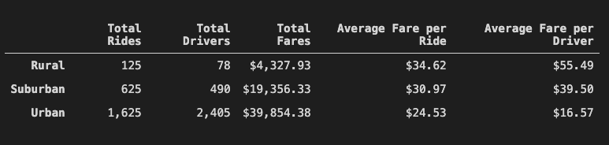
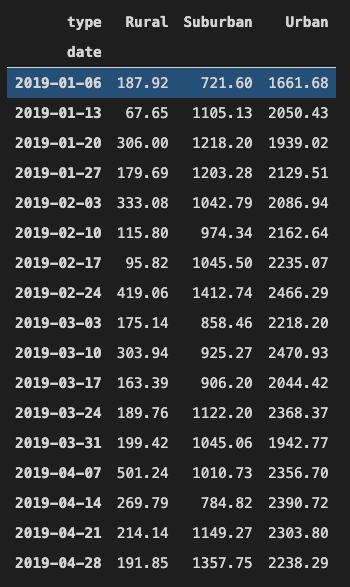
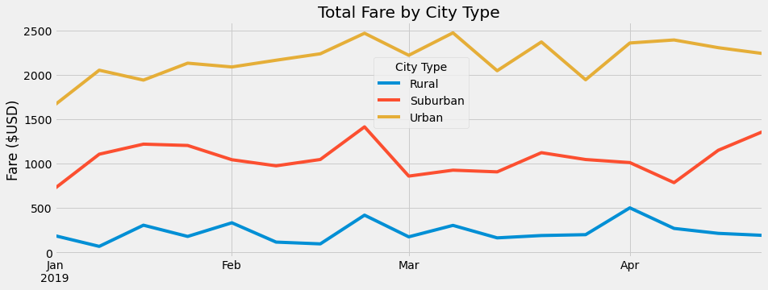

# Pyber Challenge

*****
*****

* By: Tyler Sojka
* October 2020
* PyBer With Matplotlib

*****
*****

## Overview of the project

The purpose of this project was to gather, import, analyze and finally visualize, all of the rideshare data for the ride share company, PyBer. While working with two large data files containing information about individual rides, cities, drivers and so on, we preformed the following steps.

- Build a ride-sharing summary Data Frame by city type that includes:
  - The total number of rides for each city type
  - The total number of drivers for each city type
  - The sum of the fares for each city type
  - The average fare per ride for each city type
  - The average fare per driver for each city type
- Using Pandas skills and the functions, pivot() and resample(), create a multiple-line graph that shows the total fares for each week by city type.

  
## Results
### Deliverable 1:

- From the large data sets, we started by grouping the data by types of cities: Rural, Suburban and Urban. We then summed the total fares for each city type and averaged the fares per ride, and driver. The resulting data was used to create the following PyBer Summary data frame.

### Deliverable 2:

- From the original data frame, 
  - we used groupby() to create a new Data Frame showing the sum of the fares for each date where the indices are the city type and date. 
  - We then reset the index for that table and created a pivot table with the 'date' as the index, the columns ='type', and values='fare' to get the total fares for each type of city by the date. 
  - Using the pivot table, we created a new Data Frame using loc on the given dates, '2019-01-01':'2019-04-29'. 
  - We next set the "date" index to datetime datatype so we could create a new Data Frame using the "resample()" function by week 'W' and get the sum of the fares for each week.
  
       

  - We then created a multiple-line graph, using the resampled pivot table, that shows the relationship between the total fares for each week by city type. 
  

## Summary:

Based on the overall analysis of the ride and city data a number of key disparities stick out. The largest of which is the rural metrics. Every metric measured in the analysis of the city types has rural cities at the bottom of the pile. Below are a few suggestions to help improve the bottom line, i.e., total profits.

- <b>Suggestion 1:</b> 
  By far the largest disparity between the different types of cities, is the number of drivers in each. Looking at a summary of the driver count data,  you can see that the average number of drivers in rural cities is nine to four times less per city than in urban and suburban cities, respectively. Enticing more drivers to drive in these areas could improve overall profits.

- <b>Suggestion 2:</b> 
  One way to entice drivers to drive in rural areas would be to promote area bonuses. Give drivers an incentive to drive in these areas by adding a small multiplier to the driver’s payout for each ride in the area. For example, adding a 1.1X multiplier for each ride a driver gives in rural areas would bring more drivers into the area. More drivers in the area would in turn result in more rides, and more overall revenue.

- <b>Suggestion 3:</b> 
  Another way to get more drivers into rural areas would to implement a bounty reward for drives in the area. This would essentially gamify driving in rural areas. For example, create a bonus received for x number of rides given in a rural area. By doing this, drivers would be incentivized to drive for longer periods in rural areas to get however many rides needed for a bonus on their payout. More drivers in the area would in turn result in more rides, and more overall revenue.

